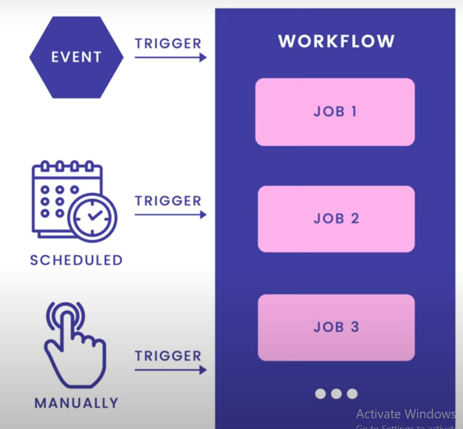
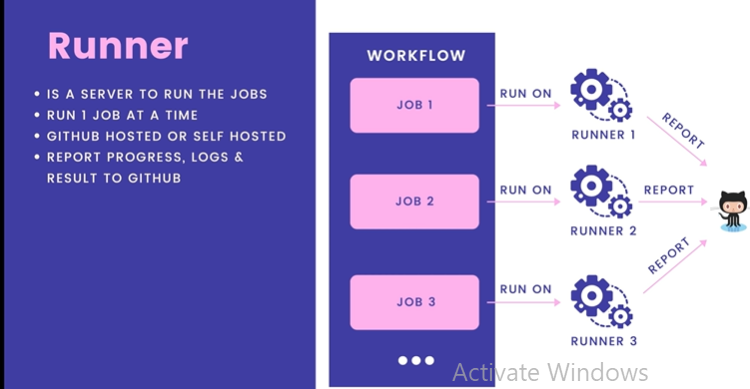
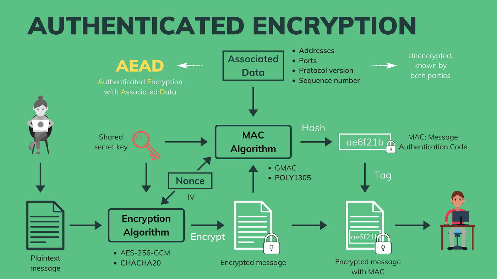
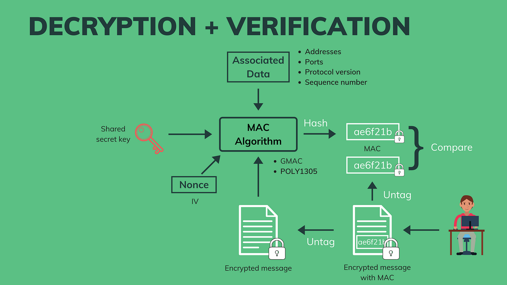
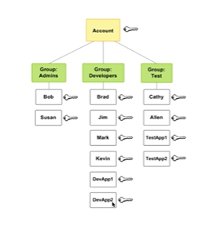

### Tools
- [x] Docker
- [x] tablePlus
- [x] redis
- [x] postgres
- [ ] redis
- [ ] jenkins
- [ ] AWS
- [ ] Github 
- [ ] Travis
- [ ] Jenkins
- [ ] CircleCl
- [ ] Actions
- [ ] Many more in future
  

### Database / Sql
😎 Very fast and straight forward
😎 Manual mapping SQL felds to variables
😎 Easy to amke mistakes, not caught until runtime

### GORM
😎  CRUD functions alreday implemented,very short production code

[GORM officical](https://gorm.io/docs/create.html) <a href="https://gorm.io/docs/create.html" style="color: blue;"></a>

- GORM take more time hence SQLX is used for Quite fast & easy to use
- Fields mapping via query text & struct tags
- Failure wont occur until runtime

[SQLC](https://sqlc.dev/) <a href="https://gorm.io/docs/create.html" style="color: blue;"></a>
- very fast and easy to use
- Authomatic code generation
- Catch SQL query errors before genearating codes


### Transation
- example
- [x] Transfer 10 rupess from bank to bank account 2
- [ ]  create a transfer record with amount = 10
- [ ]  Create an account entry for account 1 with amount = -10
- [ ]  Substract 10 from the balance of account 1
- [ ]  Add 10 from the balance of account 2
  
```
- WHY DO WE NEED DB TRANSACTION?
- [x] To provide a reliable and consistent unit of work ,even in case of system failure
- [x] To provide isolation between programs that access the database concurrently 
  
- [] ACID property must follow 
- [x] Atomicity - either all operations complete successfully or the transaction fail and the dbis unchanged.

- [x] Consistency - the db state must be vaild after the transaction. All constraints must be satisfied.

- [x] Isolation - Concurrent transactions must not affect each other.

- [x] Durability - Data written by a successful transaction must be recorded in persistent storage.
  
  How to run sqltx

  BEGIN;
  ...
  COMMIT;

  BEGIN;
  ...
  ROLLLBACK;


#### In Store_test use channel

- channel use 
```
Channel is designed to connect concurretn Go routines,
and allows them to safely share data with each other without explicit locking. In our case , we need 1 channel to receive the errors, and other channel to receive the TransferTxResult.

```

#### DB TXLOCK

debug a deadloak

##### Read Phenomena in ACID

- [x] Dirty Read          - read uncommited   cannot read commited ,cannot repeatable read ,not serializable
- [x] Non-repeatable Read - read uncommited   read commited ,cannot repeatable read ,not serializable
- [x] Phantom Read         - read uncommited  read commited,cannot repeatable read ,not serializable
- [x] Serialization anomaly - read uncommited read commited,
 repeatable read ,not serializable

# Avoiding Deadlocks in Go

## Introduction
- [x] Deadlocks can be a common issue in concurrent programming. This README provides some guidelines to help you avoid deadlocks in Go when working with goroutines and channels.

## Tips to Avoid Deadlocks

### 1. Always Release Locks in the Same Order
   - If you acquire multiple locks, ensure you release them in the same order to prevent potential deadlocks.

### 2. Use `select` with `default` Case
   - When working with channels, prefer using `select` with a `default` case to handle non-blocking operations.
   - This allows you to perform additional checks or take alternative actions when a channel operation would block.

### 3. Avoid Nested Locks
   - Avoid nesting locks whenever possible, as it increases the risk of deadlocks.
   - If you must use nested locks, always release them in the reverse order of acquisition.

### 4. Use `sync.Mutex` and `sync.RWMutex` Carefully
   - When using locks, be cautious with `sync.Mutex` and `sync.RWMutex`.
   - Prefer `sync.RWMutex` when multiple readers are expected, and use `sync.Mutex` when exclusive access is required.

### 5. Be Mindful of Channel Closures
   - Be careful when closing channels to avoid panics or deadlocks.
   - Closing a channel more than once can result in a panic, so ensure proper synchronization.

### 6. Monitor Goroutines
   - Keep an eye on your goroutines using tools like the `goroutine` package or the race detector.
   - Identify any unexpected or unhandled panics in your goroutines that might lead to deadlocks.

### 7. Use `defer` for Unlocking Mutexes
   - When using mutexes, utilize `defer` to ensure that the lock is always released, even if an error occurs or a return statement is encountered.

### 8. Leverage `context` Package for Cancellation
   - Use the `context` package to manage the lifecycle of your goroutines.
   - This allows for clean shutdowns and helps avoid situations where a goroutine is waiting indefinitely.


```

### Workflow 




### .github\workflows
- [x] ci.yml -
- ci.yml - Add tests for all functions (e.g.,
- | Workflow | Trigger      | Branches          |
| -------- | ------------ | ----------------- |
| Go       | push, pull_request | [master]          |

| Job   | Operating System | Service Containers | Service Image     | Ports                 | Health Checks |
| ----  | ----------------- | ------------------ | ----------------- | --------------------- | ------------- |
| Test  | ubuntu-latest     | postgres           | postgres:14-alpine| 5432:5432 (host:container) | Yes           |

| Steps                           |
| ------------------------------- |
| 1. Set up Go 1.x                |
| 2. Check out code               |
| 3. Install golang-migrate       |
| 4. Debug Information            |
| 5. Run migrations (Uncomment)   |
| 6. Test                          |


### Popular web frameworks

- [x] Gin -Using bz of popular web frameworks
- Beego
- Echo
- Revel
- Martini
- Fiber
- Buffalo
  
### Popular HTTP routers
- FastHttp
- Gorilla Mux
- HttpRouter
- Chi

## FILE
- [x] Viper
- Find , load, unmarshal config file
- JSON, TOML, YMAL , ENV ,INI
- Read cnfig from environment variables or flags
  override existing values, set default values
- Read Config from remote system
  Etcd, Consul
- Live watching and writing config file
  Reread changed file, save any modifications

###  MOCK DB
- use fake db: memeory  implement a fake version of db: store data in memory

### Use DB stubs: GOMOCK
generate and build stubs that returns hard-coded values
https://github.com/golang/mock


### Securely store password?

Hash it & sotre its hash value

BCRYPT HASH ------> cost , salt----> # (COST, SALT)
                                     |
--- OUTPUT --> ALG+COST+SALT+HASH    |
    Brcrypt hash #(cost, salt) <---- |
    |
	|
	|
	----> Encryption lock the server

#### Write stronger golang unit tests
with a custom for the user_test.go file

#### Why PASETO is better than JWT?
--- JSON web token (or JWT) is one of the most widely used.
    Howerver past years discovered serveral security issues regrading JSON web token, Mainly due to poorly designed Standard
--- There is Another type os token such as PASETO, Opaque Tokens
    which promises to bring better security to application.

Token-Based Authentication


                {username, password}
                --------------------------->
                POST/users/login  
🧗‍♀️🧗‍♂️           <-------------------- {200OK}         Server
Client          {access_token:JWT,PASETO,...} _________|                    
             
                --------------------------->           |
				GET /accounts                          |
				Authorization:Bearer                   |
				<access_token>                         |
				<---------------------------{200OK}____|
				  [account1,account2,...]

#### JSON WEB TOKEN - JWT

- [x] Encoded
- [x] Decoded

#### SSL/TLS
- [ ] Handshake Protocol
- [ ] Symmetric crytography
- [ ] Asymmetric crytography
- [ ] Elliptic-curve cryptography
- [ ] Digital certificates
- [ ] Certificate authority
- [ ] Digital signature
- [ ] Diffie Hellman
- [ ] Message authentication code
- [ ] Bit-flipping attack
- [ ] Quantum-computing attacks
  
- SSL:- Secure Socket Layer
  The Predecessor of TLS

- TLS:- Transport Layer Security
  A cryptographic protocol that provides secure communication over a computer network

-[x] The TLS is used in Website
HTTPS = HTTP + TLS

- [x] Email 
SMTPS = SMTP + TLS

- [x] File Transfer 
FTPS = FTP + TLS

TLS :
1. Authentication
   - Verify the identity of the communicating parties 
     with asymmetric cryptography

2. Confidentiality
 Protect the exchanged data from unauthorized
 access eith symmetric cryptography

3. Integrity
   Prevent alteration of data during transmission with
   message authentication code 

### Working of TLS
1. Handshake protocol
   - Negotiate TLS protocol version
   - Select cryptographic algorithms: cipher suites
   - Authenticate by asymmetric cryptography
   - Establish a secret key for symmetric encryption
  
2. Record protocol
   - Encrypt outgoing message with secret key
   - Transmit the encrypted message
   - Decrypt incomming messages with the secret key
   - Verify that the message are not modified
  

#### TLS USE BOTH SYMMETRIC AND ASYMMETRIC CRYPTOGRAPHY?

- Symmetric cryptography cannot be used for authentication ,key sharing is hard
- Asymmetric cryptography is much slower, thus not suitable bulk encryption

+------------------+        +---------------------+        +------------------+
|      Sam         |        |      Public Zone    |        |      Saniya      |
|                  |        |                     |        |                  |
|   +----------+   |        |                     |        |   +----------+   |
|   | Message  |   |        |                     |        |   | Message  |   |
|   +----------+   |        |                     |        |   +----------+   |
|         |        |        |                     |        |         |        |
|   +-----v-----+  |        |   +-------------+   |        |   +-----v-----+  |
|   | Encrypt   |  |        |   |   Hacker    |   |        |   | Decrypt   |  |
|   | (Secret   |---------------->|            |   |        |   | (Secret   |  |
|   | Key)      |  |        |   |            |   |        |   | Key)      |  |
|   +-----------+  |        |   +-------------+   |        |   +-----------+  |
|                  |        |                     |        |                  |
+------------------+        +---------------------+        +------------------+
In this scenario, if hacker gets a key from the database he can decrypt all the messages sent by Sam 

BIT- Flipping attack
+------------------+        +---------------------+        +------------------+
|      Customer    |        |      Public Zone    |        |       Bank       |
|                  |        |                     |        |                  |
|   +----------+   |        |                     |        |   +----------+   |
|   |  $1000   |   |        |                     |        |   |  $1000   |   |
|   +----------+   |        |                     |        |   +----------+   |
|         |        |        |                     |        |         |        |
|   +-----v-----+  |        |   +-------------+   |        |   +-----v-----+  |
|   | Encrypt   |  |        |   |   Hacker    |   |        |   | Decrypt   |  |
|   | (Secret   |---------------->|            |   |        |   | (Secret   |  |
|   | Key)      |  |        |   |            |   |        |   | Key)      |  |
|   +-----------+  |        |   +-------------+   |        |   +-----------+  |
|                  |        |                     |        |                  |
|   Encrypted      |        |    Bit-Flipping     |        |   Decrypted      |
|   Amount:        |        |    Attack on        |        |   Amount:        |
|   A3  A2  A1  A0  |        |    Amount Bits     |        |   B3  B2  B1  B0  |
+------------------+        +---------------------+        +------------------+

##### Authenticated Encryption


```
There are various MAC algorithms, each with its own specific method of computation. Some commonly used MAC(Message Authenticate Code) algorithms include:

HMAC (Hash-based Message Authentication Code): HMAC is a widely used MAC algorithm that combines a cryptographic hash function (such as SHA-256 or SHA-3) with a secret key. It provides a strong level of security against various types of attacks.

CMAC (Cipher-based Message Authentication Code): CMAC uses a block cipher, such as AES(Advanced Encryption Standard), to generate the authentication code. It is designed to provide security with respect to chosen-message attacks.

Poly1305: Poly1305 is a MAC algorithm used in conjunction with a stream cipher, often used in the context of the authenticated encryption scheme known as ChaCha20-Poly1305.
```





```
RS256, RS384, RS512:

Algorithm: RSA (Rivest–Shamir–Adleman)
Key Length: 256, 384, or 512 bits
Explanation: These algorithms use the RSA cryptographic algorithm with different key lengths (256, 384, or 512 bits). RSA is a widely used public-key cryptosystem for secure data transmission and digital signatures.
PS256, PS384, PS512:

Algorithm: RSASSA-PSS (RSA Signature Scheme with Appendix - Probabilistic Signature Scheme)
Hash Algorithm: SHA-256, SHA-384, SHA-512
Explanation: RSASSA-PSS is another digital signature scheme based on RSA, but it uses a probabilistic method for enhanced security. PS256, PS384, and PS512 refer to this scheme using different hash algorithms (SHA-256, SHA-384, SHA-512).
ES256, ES384, ES512:

Algorithm: ECDSA (Elliptic Curve Digital Signature Algorithm)
Key Length: 256, 384, or 521 bits
Explanation: These algorithms use the ECDSA, which is a digital signature algorithm based on elliptic curve cryptography. The key lengths (256, 384, or 521 bits) correspond to the length of the elliptic curve used in the algorithm.
```


![Alt text](data:image/jpeg;base64,/9j/4AAQSkZJRgABAQAAAQABAAD/2wCEAAoHCBYVFBgWFRYYGRgYGCAaGBwcGh8aHhwaGBkZHhocGR0cIy4lHCEuIRwZJjg0Ky80NTU1GiQ7QDszPy40NTEBDAwMEA8QHhISHzErJSs0NDQ2NDQ0NDQ0NDQ0NDQ0NDQ0NDQ2NDQ0NDQ0NDQ0NDQ0NDQ0NDQ0NDQ0NDQ0NDQ0NP/AABEIAKgBLAMBIgACEQEDEQH/xAAbAAEAAwEBAQEAAAAAAAAAAAAAAwQFAgYBB//EAEMQAAEDAgMFBAcGBQIFBQAAAAEAAhEDIQQSMQVBUWFxBiIykRMzcoGhsbIUQmKzwfAjUpLR4XOiFRbD0vEHJDRDgv/EABoBAQEBAQEBAQAAAAAAAAAAAAACAQMEBQb/xAAqEQACAgEDAwMEAwEBAAAAAAAAAQIRAxIhMQQTUUFx8DJhkbEFgaEjIv/aAAwDAQACEQMRAD8A1kRF5z4ARYmG2o77Y+i8937lgIIaCRO+QTrwVNu2nv8AtTmOhrGTTsLQYzaXnW/FbpZ07Uv1/p6dF5k46u9+HYyoGGpRD3HI096HEmI5KUbSrMNalULS9lJz2PaImBvGk3HkU0s3tM9Ci8wzGYllBuJNRj22LmFgaYzZbOCvUNoufimsB/huoh4bA1dcX1TSzHiaNlF5/bu0HsrMY2qKbHMJc4sDoMmLRO4BaOx6pezMaoqy4w4MyWAFo6z5o40rDg0lIvosHZO2C59dlVw7jnOaYA7jSQRbhbzXWxNrOeytUqHuscSBA7rYmLao4tDtyV/OTcRYOxdp1Hvy1rekbnpWA7snu21tfoFHgtuOGIqU6p7npHMY6AA0tcQGkjiITSx2pW14PRIsvs7in1aAe8y7MRMAWHRYr9r1c1acQ1mR7gxhpglwBMAGOQCKLugsUm2vB65F5jH7WqgYeXilnYS8lgcARoYN7/qucVtOoykxzMQ1+arlLwwNDW5RIgi8a+9boZSwvY9Si8vS2tUmq1tVtUNoueHtYG5XAWB3H981t7GrufQY95lzhJMRvPBY4tEyxtK2XUXnMRtl4rlw/wDjseKbzA8RBl062PyHFWtp4yoazMPRIa5zcznkZobfQe4/BNLHblsbKLA2pWxFCg5zqjXuztDXBgBykGQRpqo8PtF+So9uIbXLGEhgp5YMjvEjUC9k0bWFibVpno0Xnti459RzCcQx83fTLA1wsbMP3oMK12ixr6TGOY7LNQNcYB7uVxOvRNLug8bujXRYmHx1Su572OyUWBwbYFz3ATJkd0afuYztmbSqVMgdi2te50ZPRgnWBBiL/qmlm9pnrEXmXbZqsa+i8ZsRnyMIAhwdo/h/5HNegwrHNa0PdmfHedAEnfAG5Y40TKDjyTIiIQEREAREQBERAEREBgY7YDnuqvDwHPcxzDeW5QQ6Y4g7uAX1uwC0VWtc0NfTZTbrYtAku6kE+9byLdTOndlVGA/Y1UOovY9gdSphlwSCe8CY4QVLT2M+Kr3vD6tRhZMQ1oIiAPcPJbSJqY7kjzrdiV3U20X1mimNQxveIBmJPNWMTsqoKwqUXsZlYKYDgTAH7C2kTUx3ZGHidl13vp1M9POxpBlpymS7d0K08DTe1sVCwuzWyNyiIG7jMqyvoE2RybMc3JUebq9m3Ozd8AuqucSJ8D4lvW3S5Xb9hPyvY17WsqVc5iZFMGzRz08l6KowtcWnVpIPUGCuU1SK7sjDrdn2tLH0XFr2OBGdxcIGrY3LunsQEV2vIIqvL2xqwkuIN94n5rZRNTM7kvJn7FwJoUsjnBxzEyOfVUhsGW12uLSajy9hi7DJIk/25rdRNT5GuVt+TCxOyqzjRfnZnpNLSXAkOJtMb7fFdYnZVWoxge+nLKgf3WkAtAFo46rbRNTN7kiti8KHU3sYGtzsc3SBJBEmFm4PAYmmwMbUp5WtIHdM3BgzyJn3LbRFIlTaVGBT7MM9Hlc5xeQZIccubccu/d5KR2yKkUntqNFam3Jmglrm3gOm8wfittE1M3uy8mLjNmV6tFzKlRhcXhwhpDWgAyOJU1HC4kBwNSkCWw0sZcOkXM6iJWoiamNbqtvwYTNkVH1WVKr6fcMjIzKXHdmP738Vc21s91djGtcG5Xh5mdACIt1WiiamZrlafgx/+EuZUe+i5rWVAQ9hmJIPebGmvz90WzdmYikGMD6RY10nuHNBdJg8dVvspkhxGjRJ6Zg35uC5TUytcq3M2vs4uxLK0jKxhaRvJ79x/UFpIixuyHJurCIiEhERAEREAREQBERAFPRpiMzr3gDjxmL71ApWOBblcYvIOvUFTK6KjVnTmNcDAgtvEyCBrEqBWqLGw4B0uIjQ2G/XX+yrPYQYKmL3aKktkz4iKi59fKe5TnhndGo1OXhPwXSiErLrXAiQZB0Iuu6fiHUfNeY2K+oK7mMaz0QPfDXFzGO3hjiBfkJHRenp+IdR80aplyjplRLjvW1Pbd9RUTKbnaCf3xUuO9bU9t31FdPdDGW7pH+6TM/DyUybXApOTsrvYWmCIXxTj1ZnQOGXreY9ygROyZKgqe1McKFNzyJOjRxcdB+vuVxYPbCkXUARox4J6EFs+ZHmrirdFQSlJJnlMVtGrUdme9x5AkAdALBXNlbeqUnQ4ueze0mSPZJ0+SyUXpcU1R9Bwi1VHpP+bn5vVsy8JM/1f4XpNm7QZXZnZ0cDq08CvOdn9i0nUjicSe53solzW5WOaxz3lgL3Eve1jWNguIdcAFX8Zs5raNSrgnPplkmo0ZwD6OM7XMrS+k9oeHQXODm5ogiFzlBPg5z6aLj/AOdjfReZ2D2gzSyu9oIEteYbPEHdP+V6Rjw4AtIIOhBkHoQuUouL3PFKEoumdKSjQc/MW6MEkxJ0JAa22YmOIUavbJxIY4sOjyCD+KIg9YHxXLI5Ri3ErDGMpJSKj6Dgxrz4XW0ykG9iJNjFjN+Vp4WltbFNcAxt5hxI0jVsHfNj0WasxSlKNyNzRjGVRLGG8NX2B+bTVdWMN4avsD82mqr3QCYJgTAuTG4c11IlwvnqdIs7EYvMwj0dcZhHdZDhmBuL2Ij4hVdibTe97qT2vJZ98tymNwqCe675ppdWNDps213Qoue4NbqbydABEk+Y8/eOFPgcUKb8zvDlIdy0M89PjyUTclFuPJuNJySlwcfZ3ZXPuQ10OluQwI7wGYyL30iDqo1s7VxTQwsF3PDm20A0cSeInTisZRhlKSuR0zxjGSUQiIux5wiIgCIiAIiixFXIAYJkxaeBO4HghqJmPgg6wZ8laxT2EWud0aa3vzvbjwuFmfa2yBfy5x5TI9ylp1A6dxGo4FS420yk2k0doQiKiCOjRa1oa1oa0aACAFNT8Q6j5rldU/EOo+aG+pLjvW1Pbd9RUdOqW6acCJHxUmO9bU9t31FQI1fJUm1J0W8PVLzlN7HdA6QN3xGqhr0cp5fLkf3dRMdBB4GfJd1Kznam3D9/u5XNRaltwa5Jx35OF4jtXjXPrGnPcZFuLiAST5x7ua9uvJ9p9jvc81abS4OAzgXIIESBvEAacF3xtaty8DipbnlyV6NnYfaBAIwroIkS+mNeIL5HvXn34d5BGR2keE/2X6hiu12ErZ3GptFnpG0xlpmGs9G7NNODYu0cd4Xds+hHS+Wee2X2N2kX02PpvZSD2l2aowsaGuzXY153ybDUypf/AFC2RiqFevW7/wBnqvBzNfDZczJle0GZgESRBDoncvV4Ht3hKTqh/wDev9JUL4ezMGSAMtMT3WWsOZWR247Y0cXhTQo062Zz2ulzMoAaZO8zpCyynprk/NVudlMa5lYMnuPkRuDgCQR5R71iik46Ndw0OvBel7MbHe14q1GloaDkBsSSIkjcIJ14rJNadzz5XHS7PWKTDeNntt+YUTnQJOguUzXsYIPvBEEfoV5ZK00eGDqSZFhj3Ryazn/9bFMoqYDWgF0xAnjADRpyAClBSKpUbkkpSbRYw3hq+wPzaarqxhvDV9gfm01XVEy4Xz1ZHWZma5sluYES0wRO8HcVxhMIymwMY2APMneSd5U6JZluqCjr+F3sn5KRVzimHU7r7+MzHQoEW8Uf4rx+J2/SXnQbtPfA4LhV21hJJeXEmbjjuFrk+ZUtOoHabrHkd4URi4pJnTLLVJtHaIis5BERAEREBy94AJOgEnoFDUrsIuM3eAgt3k5dCFM9gIIOhEHoVyaDP5G8PCOM/O6GqiKnVY42aJ1Hd/3aW3IzFMvuu6YH8pgkkKb0bf5RbSwsvjqTT90dYg31vqFpto7Y4ESNF9XxogQNAvqwkLqn4h1HzXK6p+IdR80NXJLjvW1Pbd9ZVDE0nOc0tMRrfm08L2BG7VWtqZvSVMuvpTw0z31B3TuVIsq27zbb+Jh0yMuklvluWlv6mz6yi/NLnWgA34ZvwjeRw96mohwb3jJ4/sBRU6TxILhGWBffGptPxXIZVA8QNgNLTNybaRJ189SMe5bRAiwgErnsXgvTUqLSYApAk74EWHO66K77B4R7sjHMqUvQ0xLgW946QC0k8dRoqirO+FanVXujaxPZ14cfRulo3nXnYeKOXTVR7Y2OKLA9ry4EgGY4EgtjovQhlUAik4FsmC65nMc0RY3mJi/KFkdoMCW4f0jDVqZAO4SCSJAMAwA4foQrcVWx6p4YqLpbnjdmnvYj/W/6dNX1Q2Wx01XOY5mepmAdExlaPukjUFX1zfJ4Z8nL2BwLToQQehEKtUwrDO4TcCIktA4Wt813Wwoe6ST4YtH4t5H4vhvXJwLbyXXmdN8Tu5LEFt6nQw7Q4HjNuJcS6fcC6OpUtKnlaAJtxURwrYAk2dmGmsEXtfXfdfKOFDCIJgCL8eJ6Akf/AKK0x+5o4bw1fYH5tNV1Yw3hq+wPzaarrBLhfPVhERCTh9QN1MfufkoKr6cXAIDZ03Rp7w73yp6lMOidxn4EX81x9mZ/KP3H9h5BClRw5zInc0g8gdBJ0tPFdMqskwRM36mw/t5rv0LbiBB1G4xy8vJfPQNtbQyOEwRPxKC0SoiISEREAREQBF9psLiANTopfsr5jKfKRZuaAeMXQ1Jsw6mKP2kMz7h3czdMsnuxfj4gbWETOso/+HtLs/owXgxmyd6QIiYmYVhuHefuu0nQiwEyjKlvVIjRHtIMEEHgbFEIC6p+IdR81yuqfiHUfNDVyS471tT23fUVAp8d62p7bvqKgRmy+phFTw+0qb6jqbHEvZOYQRGUgG5EG5VxGqMaa5CIiGBT4TGvpEljsubWwMxpqFzh3NBJcM1rDnmbyMWlTMFKLkzIO+3dMjS94929EXFPlOjVodqHNa0GmHEAAnNEneYy2lZ+K2vVdmaHQ1xPdsYDjJExOpKgqBhLcpsSM2tuMADT4r6G0uLteO7Nee7ubfny0Van5Ossk5KmyqikrhkjISRF54qNScGqCIuKlQNaXOIAGpKGHaKKhXa9uZpkdCCCNQQbg8ipUNLGG8NX2B+bTVdWMN4avsD82mq6Gy4XzyEREJC+P0PRdZDwPlx0XxDTJ2C95DxUe55sRmaGwDOgBvprpwJWsoqGHYycjWtkycoAk84UpCN2zZbu0EREJCIiAIiID6x5aQRqFN9qfxGkeEaQRGmkHRQKHFVsjHvInK0ujjA0QqOpukXGYp4mDqSTYanVBin8fgD93LOmsWXk24PGvYauctMyGZspj2TYdDf9drZWJc+mC8Q8EteIjvNMablKlZ7eo6PLggpt2i9UeXGTquURUeELqn4h1HzXK6p+IdR80C5Jcd62p7bvqKgVnEhvpK2Ykd50Re+fhIm0rt9CnJh9s0DTQujrYX5wtotptswsLhXtrPefCZg5pmTItlBtfxExusVoqd1Joi5gtLo32Bge8gjpB3qQ4dkxnkSby0aC2/f8N6PcxpsqIrQoMnx8tw+7OswL26qGswCMpmRJ0secaLKMcWiNERCQiIgCIu6LATBMCCZ6NJHxAQ1HCr49rjTeGCXEd0Zssn2gQR5rSdhWxOcRE7j9wkjUGZGkbwuX4YAjvgguyzHA3MA6eE88y0pJp2ZWyab20gHtyukyA7MBe0EkwI3TZXVaOEb/ADjy/EGi885PCN6+VcM0NkPkgcry4i19Ig8TKPcNNts+Ybw1fYH5tNV1Yw3hq+wPzaarrDJcL55CIiElv7d+Buo4xDSYF54n4Lh2K8NvDOsGZm5Ma3+AVdVcfigxt7k6AW987lqtnSOqbUUagx0/dFo0I+7NjbT5Hivgxn4B1tN5J3RPhvFsvMry2zcWKZIIs6JPCJvHvXoEkmmdM0JY3TexLXrZotET8TwAACiRFhwbsIiIYEREAXxzZBBAIIIIOhBBBBX1U8TinAuDAO4JcTutMDmsPT0mHJlyf86TW9vZL3NH0bSDazjLtdQBv3aBRDkIuT5uJn3zK8mztMct2EncZHyhS4ftObNcyZMTmjU77LY9PNPg+v185ZMSjGSflL19j06IiH58Lqn4h1HzXK6p+IdR80NXJLjvW1Pbd9RUCnx3rantu+oph4Ac47oA5TN/gsk6KauTRAitU6pe4NccwdboeIVVYnfJjVcBERUSERUsRtBrTA7x+HmsbS5PT0/S5uolpxJt/r3ZdReWd2sh+XIMgtmvr03hbeG2i18TadDMgzzWyTjWpVZ2f8bnptJOuad1/ReREQ8IRzuJ5D+yLR2VQa9r5kOPckataWi7eEkn+nkuc5aY2XjhrlRmghfVpbTwzWU2XJc05QTqQQ4kHlvHCFmpjnqjYy49EqLGG8NX2B+bTVdWMN4avsD82mq66Ey4XzyEREJCkp7EZiJeXPLmMPcZAc4hzjZzrCQWjqo1fwGExDXh7Wua0C3dJL+R3BvxPKJNRuz09Jq12kaGK7P4cUjS9HlYGl/pAe8HiNXG5ke6B0WFWa0OIZJaDDZ1gaStzHuxFZhY1jqe8ywkO/CbAx0vprocOpReyz2FjuB/Q7wqnZ363VS228nKIi5nzwiIgCIiAKkaLmsq5hBdmIuNCLaKPalIudTh72y/Kcji2QQTu32CUtgMMjPVgjKf4movDTbS58ysXJ9LpZRhBxb3k1/jPE4nA1Gse7LGVpMyLQOqu4LYtdwY8MltjOZvHqvTP7JYY65z1I/7Vz/ytQZBYXtvNnAQRobBeqWScVbXJ6ssun0vRe3NmsUWbs+gW1agzvcG5QA55cO80EnqtJeU+PkgoypO9k/yF1T8Q6j5rldU/EOo+a0hckuO9bU9t31FRU6hadxBsQdCFLjvW1Pbd9RUCNWVJ1JlmnXa02ZHOc0dAVxiKGW40+U6dRw8jdQqy7FktAiTBknnrEcf0965tNO0apJqmVkRF0OZR2nXLWho1d8lg4omAxkZ6jgxkkN777C5sFqbU8Y9kfMqbafYqtVblD6OU6lweT7oFlEYuU/sj9v0bx9L/HqnUpJv7tmG3sFi7D+ELC5qGBINnHJY206cV9wVF9MOpPAD6ZDXAGYlrXAGN8OA5Qvf4VuOZhhSz0HVWtyNrHPIAEBzmZe84DfIBNyOPmtl9ia9MFrqtJwJLi7v5i46lxI7xK75tU4tM4dBmx4cybdJppkuzK5c0tOrdOn7/RXlj7MEVCPwn5hbC88HcT4381hhi6tqHDSf5Clwby17SDEmDzEGx4qJfab8rg4gkAyY1jktkri0fMxupJ/c+1MS6oQ92uVttwzMY45RJgEmeMROkDlQ4bwg3u1utjZjG7+YP+NBMkVUUhldzfuWMN4avsD82mq6sYbw1fYH5tNV1ZMuF89WEREJPv2tlIOe+zGiSYnKOMDVey7PVXOwbS2q2q7K7I8RDu87J4bWGUW4LwuOwwqU3sP32FvSQRKxew3aPEYam/DBtMNY5xhwJdmce9N4j3b10g9j6XRSuLj4P0zsx9qzP9Pmjdm1zTfLyj3aLE27tFn2urSNQPeQHNYAP4bQ1jTmI3lxJvx5LPr9vMQPCKdt5aY+peY7MZ6+IxGLqNAdUcRaYzEgvyzukNHnwVSdI753WNs9OiIuJ8YIiIAiIgKWP8VL/VH0vWhhx3p3x+qz9oeKl/qj6HpjNt0MO4CtUDSRMQXGCYBhoO8HyRXex64XcK+5mYrZROK8ZyOl5bLtGuaHCc0yS4nkvS1RAA/dgvLVe0lI1g9oeWBjmzABOZzSCASDHd3wVrYXtBh67g2lUDnX7pa5ptrGYCV1nqpWVLUoSs+4X1tbqz6FdVLC+trdWfQrq4o4ZvqXsv0F1T8Q6j5rldU/EOo+a05Lklx3rantu+oqpXJDTl1/z0PyVvHesqf6jvqKzDiXkGGG4tY6yBw4SeFlvqU1cmPTPjw79YJtmF4AvabQDbQSpqVR0w4bp6EnwzpbS3BRCs+fCYjgdZiYidF0+q8OIDJEiDfQtvoONvfyQNFlFFQeXCSIvHlYnpMxyhSrCTA7YteMO51MSWgh0ahh1d7vhJO5e/weIDmgHhbnK8+QrFPFFoiAY03fori0lR9HD1j0qE3stkemyNyTmOadOSic6ATwErCZth4tkkc3j+0ruvtRzmwGhsiDfN5WCpyR2n1GOKu79jyPY5rzQD3iC7wTqWag/p0aDvW+vgEWC+rk6u0fNz55Zp65Pfj+kcVScpy6wY6xZQOqvBIyTw1I8PGOMa/zcl1VrODoDZsCdd+bl+EdZUZrvkwwxNrHTKI1G8z0hEQkSCo+csCbmeQcRB6wI6nheWk4loJEHhEfBRGq+GkN1MOHARz1vayUaznEAti0nW1yIgjX/K0xo0MN4avsD82mq6sYbw1fYH5tNV1glwvnkIiISCVibRw8vztgFzQHDQm/iI/pHGy2KrSWkDWLLOpUy59UuIEFrGnk1uY/F5HuVRrk9nSuMXqb34MvH7Jf6Jzw8ENYXBuXWBOsr0GBDfRsygBuQEAcwD+qkZTGTLqC2OoIVbY4IoMadWAsPVjiw/SslKyM2WU07fDLqIiw8wREQBERAfCB5Ll9JrjJa0kaEgGOkoiG2PRN/lb5BfG0mgyGtB4gAHzRENs7AHnqvqIhIX1hgjqERAd4t4NR5FwXOI6FxIUaIhT5CIiGBERDAiIgCIiAIiIAiIgCIiAmovAFQE3LQBzOdh+QPkoURCpBERCQuDSbEQLmT14oiGptHTWgCBovjGAaCLk+8mSfNEQHSIiGBERAf//Z)


#### Playload
-  "payload" refers to the part of a message or data that carries the actual information you want to send. It's like the content of a package or letter, containing the meaningful data that is being transported or communicated
  
#### PASETO 
- [x] Platform-Agnostic Security token

Provide Stroger algorithms
Non-trivial security Forgery

##### PASETO STRUCTURE

###### local
- version
- Purpose
- Payload
   - Body
      - Encrypted
      - Decrypted
   - Nonce
   - Authentication
- Footer:
  - Encoded
  - Decoded


###### public

- version
- Purpose
- Payload
   - Body
      - Encrypted
      - Decrypted
   - Signature: [hex-encoded]
   - Nonce
   - Authentication
- Footer:
  - Encoded
  - Decoded 


Authorization Rules

API                --------->        Rule
Create Account                       A logged-in user can only create an account for him/herself


API                                  Rule
Get Account       ----------->       A logged-in user can get accounts but  


API               ----------->       Rule
list Accounts                        A logged-in user can only  list accounts that belong to him/herself

API                                  Rule
Transfer money    ----------->       A logged-in user can only send money from his/her own account


#### AWS 
##### Fress or 12 month period
- EC2 (AWS Elastic Compute Cloud) - Virtual servers in the    cloud, scalable computing capacity.
- IAM - IAM (AWS Identity and Access Management) - Control access to AWS services and resources securely.
- S3 - S3 (Amazon Simple Storage Service) - Object storage service for storing and retrieving data
  
##### Always Free
- Amazon Cloudfront- Content delivery network (CDN) service for fast and secure delivery of data, videos, applications, and APIs.
- Amazon DynamoDB  - Fully managed NoSQL database service for applications that need consistent, single-digit millisecond latency at any scale.

- Amazon Chime- Unified communications service that transforms online meetings with a secure, easy-to-use application.

##### Fress for 30-60 days
- Amazaon Redshift   - Fast, fully managed, petabyte-scale data warehouse service.
- Amazon Lightsail  - Virtual private servers, storage, databases, and networking for a low, predictable price.
  
######  Code deploy , code commit ,code build and code pipline  - 😋 Free services



##### Kubernetes

##### K9cli 


##### Deloy a web app to kubernetes on aws

